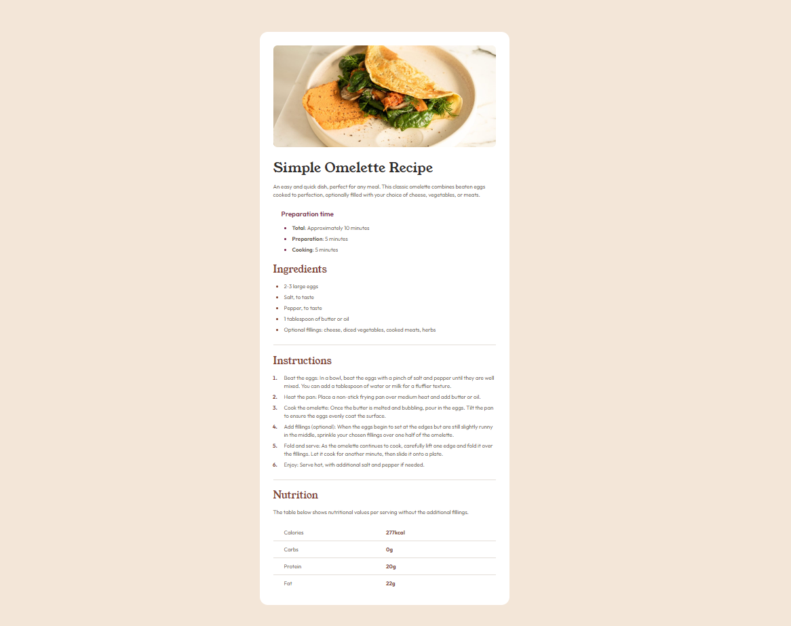

# Frontend Mentor - Recipe Page

## Overview

A solution to the [Recipe Page](https://www.frontendmentor.io/learning-paths/getting-started-on-frontend-mentor-XJhRWRREZd/challenge/65e6f48617e502f0b6ca3d02/start) challenge on Frontend Mentor. Built with plain HTML and CSS — no frameworks.

**Live Site:** https://hshs-dev.github.io/recipe-page/

## Screenshot

    

## Built with

- Semantic HTML5 (`section, ul, and ol`)
- CSS custom properties (`list-style-position`)
- Flexbox
- Mobile-first workflow

## What I learned

- **`width: 100%` + `max-width`** lets an element shrink with its parent instead of enforcing a hard floor that can overflow small viewports — the "mobile" gutter comes from padding on the parent, not a minimum width on the child.
- **`line-height` needs a unitless value** (e.g. `1.5`) relative to the element's own font size — a fixed `rem` value smaller than the font size crushes the line box and causes overlapping text.
- **`list-style-position`** is actually very handy in making sense of the list bullet point position, making styling more logical

## Author

- GitHub - [@HsHs-dev](https://github.com/HsHs-dev)
